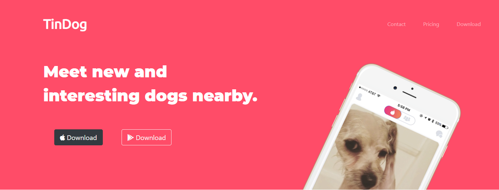

# TinDog-project

This is a copy website of TinDog which I made using Bootstrap and HTML and CSS. To run the website, just download the files and open "index.html" using any browser. This is only the front page and functionality still lacks. 

This project gave me a profound knowledge about using HTML,advanced CSS and Bootstrap classes. It also helped me writing DRY code and learn how to debug more quickly and efficiently.

